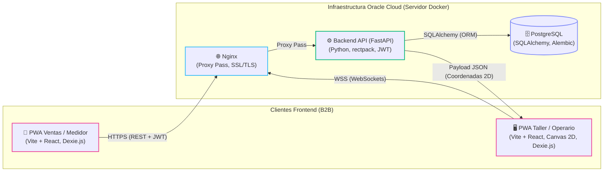

# AVAO — Arquitectura de Software
**Sistema PWA B2B con optimización de cortes 2D y sincronización bidireccional**

A continuación se detalla la arquitectura objetivo de AVAO, dividida en dos entornos principales. El diagrama describe entregables previstos; la implementación actual se resume al final.

## Diagrama de Arquitectura (Mermaid)

---

## 1. Clientes Frontend (B2B)

Esta zona agrupa las aplicaciones progresivas (PWA) utilizadas por el personal de la empresa.

### PWA Ventas / Medidor
*   **Descripción:** Aplicación diseñada para smartphones orientada a la captura de pedidos, datos del cliente y cotización en el momento.
*   **Stack Tecnológico:**
    *   Vite + React
    *   Dexie.js (Soporte Offline)

### PWA Taller / Operario
*   **Descripción:** Aplicación en formato tablet para la vista de producción. Se encarga del renderizado visual de la guía de corte.
*   **Stack Tecnológico:**
    *   Vite + React
    *   HTML5 Canvas 2D
    *   Dexie.js (Soporte Offline)

---

## 2. Infraestructura Oracle Cloud (Servidor Docker)

Este entorno contiene los servicios backend desplegados mediante contenedores.

### Nginx
*   **Descripción:** Actúa como proxy inverso, encargándose de la terminación de los certificados SSL y el enrutamiento de conexiones seguras (incluyendo WebSockets).
*   **Stack Tecnológico:**
    *   Proxy Pass
    *   SSL/TLS

### Backend API (FastAPI)
*   **Descripción:** El núcleo del sistema. Maneja la lógica de negocio, la autenticación basada en roles (RBAC) y el motor de cálculo algebraico para la optimización de los cortes (guillotina).
*   **Stack Tecnológico:**
    *   Python (FastAPI)
    *   rectpack (Algoritmo de Guillotina)
    *   fastapi-users (Autenticación JWT)

### PostgreSQL
*   **Descripción:** Base de datos relacional para la persistencia segura de la información de usuarios, roles, catálogo, inventario y registros de pedidos.
*   **Stack Tecnológico:**
    *   SQLAlchemy (ORM)
    *   Alembic (Migraciones de esquema)

---

## 3. Flujo de Comunicación e Integración

Las interacciones entre los nodos se realizan de la siguiente manera:

1.  **Ventas ➔ Proxy:** La *PWA Ventas* se comunica con *Nginx* a través de **HTTPS (REST + JWT)**.
2.  **Taller ➔ Proxy:** La *PWA Taller* establece una conexión en tiempo real con *Nginx* a través de **WSS (WebSockets)**.
3.  **Proxy ➔ Backend:** *Nginx* canaliza el tráfico entrante hacia el *Backend API* mediante un **Proxy Pass**.
4.  **Backend ➔ Base de Datos:** El *Backend FastAPI* realiza transacciones de lectura/escritura en *PostgreSQL* utilizando **SQLAlchemy (ORM)**.
5.  **Backend ➔ Taller:** Una vez que el algoritmo procesa la optimización, el *Backend* envía un **Payload JSON (Coordenadas 2D)** directamente a la *PWA Taller* para que Canvas 2D pueda dibujar los cortes.

## 4. Estado de implementación (2026-10-05)

- **Disponible:** API FastAPI con PostgreSQL/SQLAlchemy/Alembic para pedidos, listado de piezas pendientes y finalización de piezas; Ventas con formulario y cola Dexie; Taller con vista de tarjetas que consulta la API por REST. Véanse #26–#31 y #38, vinculadas a HU-01, HU-02 y HU-08.
- **Pendiente:** JWT/RBAC (`fastapi-users`), WSS, Canvas 2D, optimización con `rectpack`, entrega del JSON de coordenadas, caché Service Worker y despliegue SSL en Oracle Cloud. Las dependencias en manifests no implican funcionalidad terminada.
- **Medidas:** el contrato y el esquema presentes usan `*_mm` y `NUMERIC(10,2)`, mientras la especificación actual exige pulgadas en pasos de 1/16. #35 debe definir la representación, conversión, migración y validación antes de aplicar el cambio.
