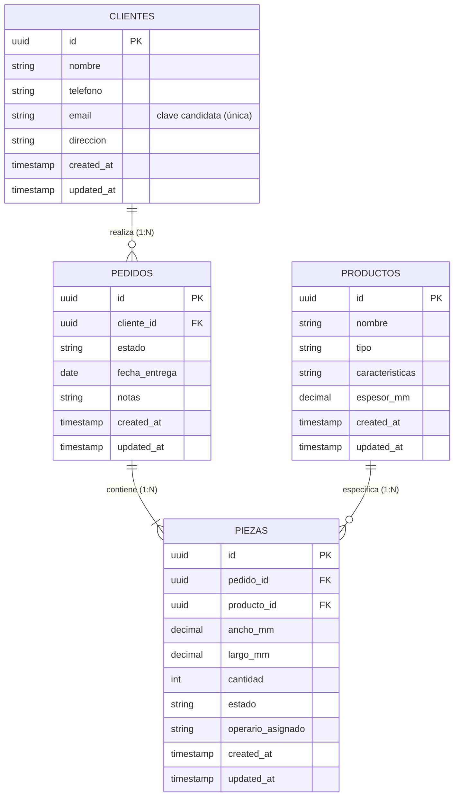
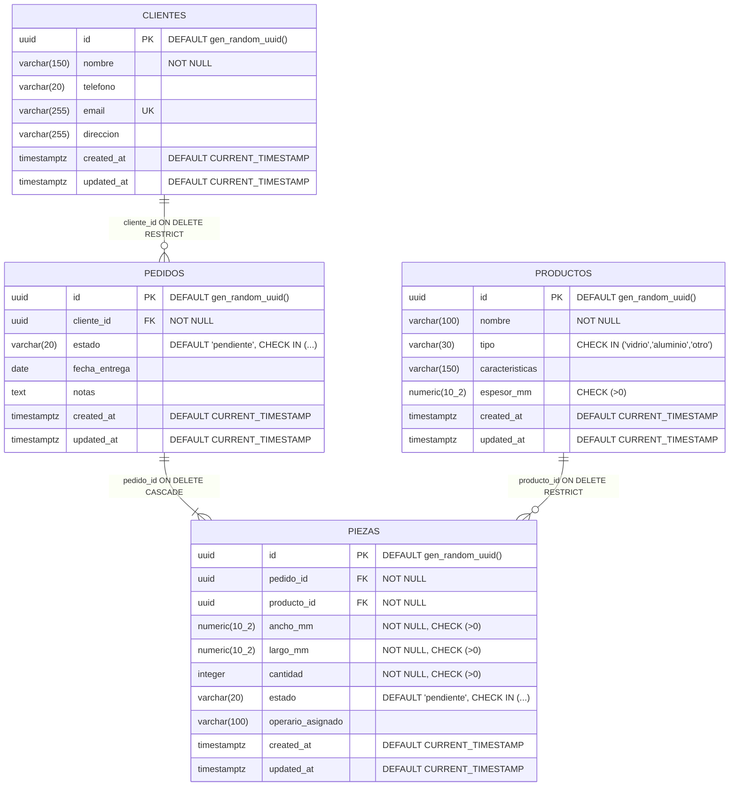

# ERD Fase 1 — Diseño Lógico y Físico de Base de Datos (AVAO)

- **Subtarea:** #26 — Diseño Lógico/Físico y Migración (PostgreSQL)
- **Historias de Usuario relacionadas:** HU-01 (Registrar el pedido del cliente), HU-02 (Saber qué hacer hoy), HU-03 (Proteger los datos del negocio)
- **Estándar de referencia:** IEEE Std 1016-2009 (Software Design Descriptions)
- **Stack:** FastAPI + PostgreSQL 17 + SQLAlchemy 2.0 + Alembic, UUIDs, `rectpack` (fase posterior)
- **Fecha:** 2026-10-04

> **YAGNI / Cero sobreingeniería:** Este documento modela únicamente las entidades estrictamente necesarias para el flujo de captura de pedidos (Ventas) y de visualización/actualización de cortes (Taller): `clientes`, `pedidos`, `productos`, `piezas`. Tablas de optimización 2D (guillotina/rectpack), inventario avanzado (HU-14) y usuarios/RBAC (HU-10, HU-03) se integrarán en fases posteriores.

---

## 1. Reglas de diseño no negociables

| Regla | Decisión |
|---|---|
| PKs | `UUID` con default `gen_random_uuid()` (PostgreSQL 13+, nativo en 17) |
| Fechas/timestamps | `TIMESTAMP WITH TIME ZONE` (`TIMESTAMPTZ`), default `CURRENT_TIMESTAMP` |
| Medidas (mm) | `NUMERIC(10, 2)` con `CHECK (> 0)` |
| Cantidades | `INTEGER` con `CHECK (> 0)` |
| Estados | `VARCHAR(20)` con `CHECK (estado IN (...))` (justificación en §6.1) |
| FKs | Explícitas, con `ON DELETE` justificado (§4) |
| Índices | B-tree en todas las FKs y en columnas de filtro frecuente (`estado`, `operario_asignado`) |

---

## 2. Modelo Lógico de Datos (LMD)

Vista de negocio: entidades, atributos, relaciones y cardinalidades. Un **cliente** realiza muchos **pedidos**; un **pedido** contiene muchas **piezas**; cada **pieza** referencia un **producto** del catálogo. Un **operario** (texto, fase 1) se asigna a muchas **piezas**.



**Claves candidatas:** además de `id`, `clientes.email` es clave candidata (única, nullable). No existen candidatos naturales adicionales evidentes; `id` UUID queda como PK.

---

## 3. Modelo Físico de Datos (PMD)

Tipos concretos de PostgreSQL 17, restricciones e índices.



Índices (btree): `idx_pedidos_cliente_id`, `idx_pedidos_estado`, `idx_piezas_pedido_id`, `idx_piezas_producto_id`, `idx_piezas_estado`, `idx_piezas_operario`, `idx_productos_tipo`, más índices implícitos de PKs y de `clientes.email` (UNIQUE).

---

## 4. Diccionario de datos

Convención: **NL** = nullable, **N** = NOT NULL. `PK`/`FK`/`UK` = primary/foreign/unique key.

### 4.1 `clientes` — HU-01

| Campo | Tipo | NL | Default | Clave | Checks | Índices | Descripción | Justificación |
|---|---|---|---|---|---|---|---|---|
| `id` | UUID | N | `gen_random_uuid()` | PK | — | implícito | Identificador único del cliente | UUID v4 evita colisiones en escrituras concurrentes y no expone secuencias (HU-03: no filtrar información sensible) |
| `nombre` | VARCHAR(150) | N | — | — | — | — | Nombre completo o razón social | VARCHAR acotado evita payloads abusivos; requerido por criterio de aceptación de HU-01 |
| `telefono` | VARCHAR(20) | L | — | — | — | — | Teléfono de contacto | Nullable: no todo cliente aporta teléfono en el primer contacto |
| `email` | VARCHAR(255) | L | — | UK | — | implícito | Correo electrónico | Único a nivel BD para evitar duplicados; nullable porque el teléfono puede ser el único dato |
| `direccion` | VARCHAR(255) | L | — | — | — | — | Dirección del cliente | Opcional en fase 1 |
| `created_at` | TIMESTAMPTZ | N | `CURRENT_TIMESTAMP` | — | — | — | Fecha/hora de alta | Zona horaria explícita (Oracle Cloud, usuarios en MX) |
| `updated_at` | TIMESTAMPTZ | N | `CURRENT_TIMESTAMP` | — | — | — | Última modificación | Auditoría básica sin triggers extra (lo gestiona la app en fase 1) |

### 4.2 `productos` — HU-01

| Campo | Tipo | NL | Default | Clave | Checks | Índices | Descripción | Justificación |
|---|---|---|---|---|---|---|---|---|
| `id` | UUID | N | `gen_random_uuid()` | PK | — | implícito | Identificador del producto | Idem a clientes |
| `nombre` | VARCHAR(100) | N | — | — | — | — | Nombre comercial (p. ej. "Vidrio claro 6mm") | Requerido, legible por Ventas |
| `tipo` | VARCHAR(30) | N | — | — | `IN ('vidrio','aluminio','otro')` | `idx_productos_tipo` | Categoría del material | CHECK garantiza vocabulario cerrado; índice por ser filtro habitual en captura HU-01 |
| `caracteristicas` | VARCHAR(150) | L | — | — | — | — | Atributos libres (esmerilado, templado, etc.) | Nullable; soporte al criterio "seleccionar características" de HU-01 |
| `espesor_mm` | NUMERIC(10,2) | L | — | — | `> 0` | — | Espesor en milímetros | Nullable porque 'otro' podría no aplicarlo; `NUMERIC` exacto, sin error de punto flotante; CHECK evita negativos |
| `created_at` | TIMESTAMPTZ | N | `CURRENT_TIMESTAMP` | — | — | — | Alta | Estándar |
| `updated_at` | TIMESTAMPTZ | N | `CURRENT_TIMESTAMP` | — | — | — | Modificación | Estándar |

### 4.3 `pedidos` — HU-01 (#27)

| Campo | Tipo | NL | Default | Clave | Checks | Índices | Descripción | Justificación |
|---|---|---|---|---|---|---|---|---|
| `id` | UUID | N | `gen_random_uuid()` | PK | — | implícito | Identificador del pedido | Estándar |
| `cliente_id` | UUID | N | — | FK → `clientes.id` (`ON DELETE RESTRICT`) | — | `idx_pedidos_cliente_id` | Cliente dueño del pedido | RESTRICT: no se puede borrar un cliente con historial (integridad de negocio); índice por la FK (JOIN/listado por cliente) |
| `estado` | VARCHAR(20) | N | `'pendiente'` | — | `IN ('pendiente','en_proceso','completado','cancelado')` | `idx_pedidos_estado` | Estado del flujo de trabajo | Filtrado frecuente (listados por estado) → índice; CHECK en lugar de ENUM nativo (§6.1) |
| `fecha_entrega` | DATE | L | — | — | — | — | Fecha comprometida de entrega | Nullable hasta acordar con cliente |
| `notas` | TEXT | L | — | — | — | — | Observaciones libres | TEXT ilimitado razonable para notas |
| `created_at` | TIMESTAMPTZ | N | `CURRENT_TIMESTAMP` | — | — | — | Alta | Estándar |
| `updated_at` | TIMESTAMPTZ | N | `CURRENT_TIMESTAMP` | — | — | — | Modificación | Estándar |

### 4.4 `piezas` — HU-01, HU-02 (#29, #30, #31)

| Campo | Tipo | NL | Default | Clave | Checks | Índices | Descripción | Justificación |
|---|---|---|---|---|---|---|---|---|
| `id` | UUID | N | `gen_random_uuid()` | PK | — | implícito | Identificador de la pieza | Estándar |
| `pedido_id` | UUID | N | — | FK → `pedidos.id` (`ON DELETE CASCADE`) | — | `idx_piezas_pedido_id` | Pedido al que pertenece | CASCADE: la pieza no tiene sentido sin su pedido; índice por FK (listado de piezas del pedido) |
| `producto_id` | UUID | N | — | FK → `productos.id` (`ON DELETE RESTRICT`) | — | `idx_piezas_producto_id` | Material/producto asociado | RESTRICT: proteger histórico de piezas; índice por FK |
| `ancho_mm` | NUMERIC(10,2) | N | — | — | `> 0` | — | Ancho en mm (criterio HU-01: "medidas exactas") | Exacto (NUMERIC), obligatorio y positivo; rango hasta 99,999,999.99 mm |
| `largo_mm` | NUMERIC(10,2) | N | — | — | `> 0` | — | Largo en mm | Idem |
| `cantidad` | INTEGER | N | — | — | `> 0` | — | Número de cortes iguales | Entero positivo obligatorio |
| `estado` | VARCHAR(20) | N | `'pendiente'` | — | `IN ('pendiente','en_corte','completado')` | `idx_piezas_estado` | Estado de corte (HU-02 / #31) | Filtro frecuente en Taller → índice; valores alineados al flujo de operario |
| `operario_asignado` | VARCHAR(100) | L | — | — | — | `idx_piezas_operario` | Nombre/identificador de operario (fase 1) | HU-02 exige listar cortes "asignados específicamente al operario activo"; se filtra por este campo → índice. En fase posterior (HU-10) se sustituye por FK a tabla de usuarios |
| `created_at` | TIMESTAMPTZ | N | `CURRENT_TIMESTAMP` | — | — | — | Alta | Estándar |
| `updated_at` | TIMESTAMPTZ | N | `CURRENT_TIMESTAMP` | — | — | — | Modificación | Estándar |

> **HU-03 (RBAC):** El modelo no incluye precios ni datos financieros; el operario solo necesita `ancho_mm`, `largo_mm`, `cantidad`, `estado`, `producto` y `operario_asignado`. La segregación de acceso se implementará en capa de aplicación (fastapi-users) en fase posterior; el diseño de columnas ya evita exponer importes.

---

## 5. DDL SQL preliminar (PostgreSQL 17)

Probado y válido. Ejecutable como script completo:

```sql
BEGIN;

CREATE TABLE clientes (
    id          UUID PRIMARY KEY DEFAULT gen_random_uuid(),
    nombre      VARCHAR(150) NOT NULL,
    telefono    VARCHAR(20),
    email       VARCHAR(255) UNIQUE,
    direccion   VARCHAR(255),
    created_at  TIMESTAMPTZ NOT NULL DEFAULT CURRENT_TIMESTAMP,
    updated_at  TIMESTAMPTZ NOT NULL DEFAULT CURRENT_TIMESTAMP
);

CREATE TABLE productos (
    id              UUID PRIMARY KEY DEFAULT gen_random_uuid(),
    nombre          VARCHAR(100) NOT NULL,
    tipo            VARCHAR(30) NOT NULL CHECK (tipo IN ('vidrio', 'aluminio', 'otro')),
    caracteristicas VARCHAR(150),
    espesor_mm      NUMERIC(10, 2) CHECK (espesor_mm > 0),
    created_at      TIMESTAMPTZ NOT NULL DEFAULT CURRENT_TIMESTAMP,
    updated_at      TIMESTAMPTZ NOT NULL DEFAULT CURRENT_TIMESTAMP
);

CREATE TABLE pedidos (
    id            UUID PRIMARY KEY DEFAULT gen_random_uuid(),
    cliente_id    UUID NOT NULL REFERENCES clientes(id) ON DELETE RESTRICT,
    estado        VARCHAR(20) NOT NULL DEFAULT 'pendiente'
                  CHECK (estado IN ('pendiente', 'en_proceso', 'completado', 'cancelado')),
    fecha_entrega DATE,
    notas         TEXT,
    created_at    TIMESTAMPTZ NOT NULL DEFAULT CURRENT_TIMESTAMP,
    updated_at    TIMESTAMPTZ NOT NULL DEFAULT CURRENT_TIMESTAMP
);

CREATE TABLE piezas (
    id                UUID PRIMARY KEY DEFAULT gen_random_uuid(),
    pedido_id         UUID NOT NULL REFERENCES pedidos(id) ON DELETE CASCADE,
    producto_id       UUID NOT NULL REFERENCES productos(id) ON DELETE RESTRICT,
    ancho_mm          NUMERIC(10, 2) NOT NULL CHECK (ancho_mm > 0),
    largo_mm          NUMERIC(10, 2) NOT NULL CHECK (largo_mm > 0),
    cantidad          INTEGER NOT NULL CHECK (cantidad > 0),
    estado            VARCHAR(20) NOT NULL DEFAULT 'pendiente'
                      CHECK (estado IN ('pendiente', 'en_corte', 'completado')),
    operario_asignado VARCHAR(100),
    created_at        TIMESTAMPTZ NOT NULL DEFAULT CURRENT_TIMESTAMP,
    updated_at        TIMESTAMPTZ NOT NULL DEFAULT CURRENT_TIMESTAMP
);

CREATE INDEX idx_pedidos_cliente_id   ON pedidos(cliente_id);
CREATE INDEX idx_pedidos_estado       ON pedidos(estado);
CREATE INDEX idx_piezas_pedido_id     ON piezas(pedido_id);
CREATE INDEX idx_piezas_producto_id   ON piezas(producto_id);
CREATE INDEX idx_piezas_estado        ON piezas(estado);
CREATE INDEX idx_piezas_operario      ON piezas(operario_asignado);
CREATE INDEX idx_productos_tipo       ON productos(tipo);

COMMIT;
```

---

## 6. Notas de diseño, SQLAlchemy 2.0 y Alembic

### 6.1 Estados: `VARCHAR` + `CHECK` vs ENUM nativo de PostgreSQL

**Decisión: `VARCHAR(20)` con restricción `CHECK (estado IN (...))`.**

- **Alembic:** los ENUM nativos de PostgreSQL obligan a migraciones manuales para `ALTER TYPE ... ADD VALUE` (no capturables bien por `autogenerate` y riesgosas en `--` operaciones online). Cambiar un CHECK es un `drop_constraint`/`add_constraint` estándar, totalmente soportado.
- **Portabilidad y simplicidad:** el CHECK se comporta igual en SQLite (útil en tests) y documenta los valores permitidos en el propio DDL.
- **Costo:** se pierde la validación a nivel de tipo (un VARCHAR aceptaría cualquier cadena si se elimina el CHECK), mitigado re-creando el CHECK en cada migración. Si el conjunto de estados se estabiliza y se requiere estricto, se puede migrar a ENUM nativo en una fase posterior.

### 6.2 Modelos SQLAlchemy 2.0 (alineación esperada en código)

- `DeclarativeBase` con `Mapped[...]` / `mapped_column(...)` (estilo 2.0).
- PK: `mapped_column(Uuid, primary_key=True, default=uuid.uuid4, server_default=func.gen_random_uuid())` — se declara también `server_default` para que registros insertables vía SQL crudo o migraciones tengan el default.
- Timestamps: `mapped_column(DateTime(timezone=True), server_default=func.now(), nullable=False)`.
- Medidas: `mapped_column(Numeric(10, 2), CheckConstraint('ancho_mm > 0'))`.
- FKs: `ForeignKey('pedidos.id', ondelete='CASCADE')` + `index=True` o `Index(...)` explícito para producir los nombres de índice del PMD.
- Estados: `mapped_column(String(20), server_default='pendiente')` + `CheckConstraint("estado IN (...)")`.
- Relaciones con `relationship(..., passive_deletes=True)` cuando la eliminación en cascada la realiza la BD (`piezas` ← `pedidos`).

### 6.3 Alembic

- `target_metadata = Base.metadata` en `env.py` para que `alembic revision --autogenerate` detecte el esquema definido en los modelos.
- Primera migración: réplica textual del DDL de §5 (`upgrade()` con `op.create_table`, `op.create_index`, `op.create_check_constraint`, `op.create_foreign_key` cuando se requiera por orden). `downgrade()` hace `DROP TABLE` en orden inverso.
- Convención de nombres de constraints recomendada en `Base.metadata` (`naming_convention`) para que Alembic genere migraciones determinísticas.
- `render_as_batch=False` (PostgreSQL no necesita batch mode).

### 6.4 Índices

Todos los índices propuestos son `btree` (default), apropiados para igualdad y rangos sobre UUIDs/VARCHAR en filtros del Taller (`piezas.estado`, `piezas.operario_asignado`) y en JOINs por FK. No se definen claves primarias compuestas ni índices `GIN`/`BRIN` en esta fase (YAGNI).

---

## 7. Validación del DDL (TDD / QA equivalente)

- **Método:** ejecución real del script §5 contra un motor PostgreSQL mediante **PGlite 0.5.8 (PostgreSQL 18.3, WASM)** en Node v26. No se dispuso de `psql` ni de acceso sudo/docker para `postgres:17`; la sintaxis y semántica utilizadas (`gen_random_uuid`, `NUMERIC(10,2)`, `TIMESTAMPTZ`, CHECKs, FK con `ON DELETE`, `CREATE INDEX`) es estándar y plenamente compatible con PostgreSQL 17.
- **Fecha de prueba:** 2026-10-04
- **Resultado:** ✅ sin errores.

| Prueba | Resultado |
|---|---|
| Ejecución completa del DDL (`BEGIN...COMMIT`) | OK — 4 tablas creadas |
| Tablas presentes | `clientes`, `pedidos`, `piezas`, `productos` |
| Índices presentes | 7/7: `idx_pedidos_cliente_id`, `idx_pedidos_estado`, `idx_piezas_estado`, `idx_piezas_operario`, `idx_piezas_pedido_id`, `idx_piezas_producto_id`, `idx_productos_tipo` |
| INSERT válido en las 4 tablas | OK |
| Rechazar `ancho_mm = -5` (CHECK) | OK — error 23514 |
| Rechazar `cantidad = 0` (CHECK) | OK — error 23514 |
| Rechazar `piezas.estado = 'roto'` (CHECK) | OK — error 23514 |
| Rechazar `pedidos.estado = 'raro'` (CHECK) | OK — error 23514 |
| Rechazar `productos.tipo = 'plastico'` (CHECK) | OK — error 23514 |
| Rechazar `clientes.email` duplicado (UNIQUE) | OK — error 23505 |
| Rechazar DELETE de cliente con pedidos (FK RESTRICT) | OK — error 23001 |
| DELETE de pedido elimina piezas en cascada (CASCADE) | OK — 0 piezas restantes |

**Conclusión:** el DDL compila y las restricciones de integridad (CHECKs, UNIQUE, FKs, cascadas) se comportan conforme al diseño. Cero errores de integridad/compilación.

---

## 8. Trazabilidad

| Artefacto | Referencias |
|---|---|
| Este documento `docs/design/ERD-FASE1.md` | #26, HU-01, HU-02, HU-03 |
| Tablas `clientes`, `productos`, `pedidos`, `piezas` | HU-01 (captura de cliente, producto, medidas y cantidad) |
| `piezas.estado`, `piezas.operario_asignado` | HU-02 (lista de cortes del día por operario), #29/#30/#31 |
| Ausencia de datos financieros, validación de columnas técnicas | HU-03 (acceso restringido del operario) |
